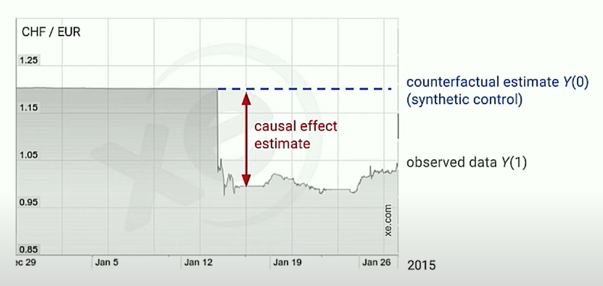
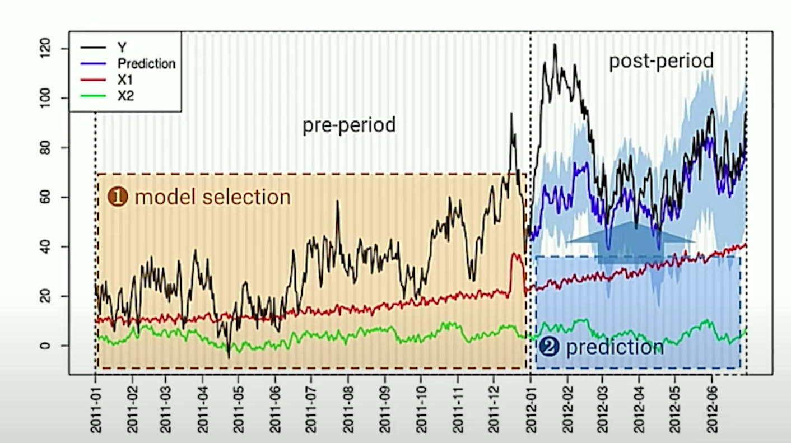

```{r setup, include=FALSE}
library(dplyr)
library(ggplot2)
library(knitr)
library(here)
library(CausalImpact)
library(ggthemes)
library(zoo)
library(readr)
library(anytime)
library(tidyr)
library(lubridate)

set.seed(1)

source(here::here("R", "sleep.R"))

knitr::opts_chunk$set(echo = TRUE)
```

class: inverse middle

.center[
  
]

<br>

<small>Imagine a world where you rarely leave home, have little separation between your work and home life, have lost track of time, and haven't quite mastered a regular sleep cycle. __Great, I'm right there with you.__</small>

---

class: inverse

## Was there a decline in sleep quality in March?

```{r visualizing-sleep-statistics, echo=FALSE, fig.height=5, fig.width=11, warning=FALSE}
suppressWarnings({
  get_sleep_data(root = here::here(), rolling_average_window = 7) %>%
    dplyr::filter(dt >= "2019-10-01") %>%
    ggplot2::ggplot() +
    ggplot2::geom_line(ggplot2::aes(x=dt, y=sleep_score)) +
    ggplot2::xlab("Date") + 
    ggplot2::ylab("Fitness Tracker Sleep Score") +
    ggthemes::theme_fivethirtyeight() 
})
```

<small>With a fitness tracker, we have an imperfect proxy.  **At first glance, it looks like there is a shift in late March, were there any major changes?**  If we identify a potential cause, can estimate how much it has affected sleep quality?</small>

---

class: inverse

## Why might that be? Oh right...


---

## What are our limitations when estimating the impact?

.large[
1. We only have historical data for a single subject
2. Too expensive to recreate an experiment
3. Time travel not yet available
]

.pull-bottom[
**Our challenge:** We need to estimate the outcome as if the 'treatment' never occurred. (i.e., the counterfactual)
]

---

## An easy-to-estimate counterfactual `Y(0)`



---

## Estimate `Y(0)` with `CausalImpact`



`CausalImpact` is an R package for causal inference using Bayesian structural time-series models.

---

## Why build this model?

Our goal is to estimate the `counterfactual` $Y(0)$ (i.e, a synthetic control).  That `counterfactual` represents a belief about observed data $Y(1)$ if the treatment had never occurred.

### What are the inputs and assumptions?

1. Observed Data $Y(1)$
2. A `treatment` with a well defined start and end date.
3. A series of `covariate` time-series that **are assumed to be**:
    - Co-occuring during the same date range as $Y(1)$
    - Correlated to $Y(1)$ in the defined `pre-period`
    - Have an relationship with the observed $Y(1)$ established in the `pre-period` which remains stable through the `post-period`
    - Are NOT themselves impacted by the `treatment`

---

```{r creating-inputs, fig.height=4, fig.width=10}
library(zoo); set.seed(1);

x1 <- 100 + arima.sim(model = list(ar = 0.999), n = 100)
y  <- 1.2 * (x1) + rnorm(100)     
y[71:100] <- y[71:100] + 10
start <- as.Date("2020-01-01")
time.points <- seq.Date(start, by = 1, length.out = 100)
data <- zoo::zoo(cbind(y, x1), time.points)

zoo::autoplot.zoo(data, facets = NULL)
```

---

```{r, visualizing-impact, fig.height=6, fig.width=10}
pre.period  <- as.Date(c("2020-01-01", "2020-03-11"))  
post.period <- as.Date(c("2020-03-12", "2020-04-09"))  

impact <- CausalImpact(data, pre.period, post.period)
plot(impact)
```

---

```{r, summary-of-impact}
summary(impact)
```

---

## Finding Relevant Covariates

```{r fig.height=4, fig.width=10}
library(gtrendsR)
keywords <- c("insomnia", "pet adoption", "wfh", "sourdough")
trends <- gtrendsR::gtrends(keywords, time ="2020-01-01 2020-09-01")
plot(trends)
```
.pull-bottom[
_Note:_ For our sleep problem, these are likely poor choices because they likely violate the assumption that the covariates are unaffected by the treatment, COVID19 and the government response in the United States.
]

---

## Can we use the weather for our covariates instead?

```{r, fig.width=10, echo=FALSE}
sleep_data <- get_sleep_data_for_causal_impact(here::here(), 7)
zoo::autoplot.zoo(sleep_data)
```

---

```{r fig.height=5, fig.width=10, image-impact-two}
pre.period  <- as.Date(c("2019-09-04", "2020-03-27"))
post.period <- as.Date(c("2020-03-28", "2020-09-02"))

s_impact <- CausalImpact(sleep_data, pre.period, post.period)
plot(s_impact)
```

---

```{r, summary-of-impact-two}
summary(s_impact)
```

---

## Inconclusive? Some popular reasons...

1. There was no impact.
2. The true treatment occurred at another time.
3. An inappropriate prior was chosen.
4. Multiple, 'treatments' occurred in same time period.
5. Reliance on too few covariates (spurious correlation overtook model)
6. Covariant time-series are not correlated with target `pre.period`

.pull-bottom[
  __In the case of the prior analysis, many of these are probably true.__
]

---

## Started WFH on March 16th, is it the 'treatment' we are looking for?

```{r, fig.height=5, fig.width=10, image-impact-three}
pre.period  <- as.Date(c("2019-09-04", "2020-03-15"))
post.period <- as.Date(c("2020-03-16", "2020-09-02"))

s_impact <- CausalImpact(sleep_data, pre.period, post.period)
plot(s_impact)
```

---

## Outputs are sensitive to period, prior, and covariates.

```{r, summary-of-impact-three}
summary(s_impact)
```

---

## Under the hood: State Space Model

A state space model, defined by an observation equation (1), linking observed data $y_{t}$ to a latent state $\alpha_{t}$ over time. And a state equation (2), dictating the change in state $\alpha_{t}$ over time.

$$y_{t} = Z_{t}^{T} \alpha_{t} + \epsilon_{t} \\ \alpha_{t+1} = T_{t}\alpha_{t} + R_{t}\eta_{t}$$

- scalar observation: $y_{t}$
- output vector: $Z_{t}$
- state vector: $\alpha_{t}$
- observation error: $\epsilon_{t}$
- transition matrix: $T_{t}$
- control matrix: $R_{t}$
- system error vector: $\eta_{t}$

---

## State has mulitiple components in the model

The state vector $\alpha_{t}$ is modular, and allows for the inclusion of elements from different aggregates.

- Local Linear Trends
- Multiple levels of seasonality
- Contemporaneous covariates
    - with static coefficient
    - with dynamic coefficient

.pull-bottom[
Given too many covariates, the model uses a _spike-and-slab_ technique to help determine which covariates to include, and how strongly they should influence the predictions.
]

---

## Simulating the counterfactual

1. For the training period, simulate draws of the state vector $\alpha_{t}$ and model parameters given $y_{t}$
2. Simulate outcomes the counterfactual period $\bar{y}_{n+1:m}$ given pre-intervention $y_{1:n}$
3. Use posterior samples to calculate point-wise impact $y_{t}-\bar{y}_{t}$ for each $t = 1,...,m$, aggregate for cumulative impact estimate.

---

class: center middle inverse

## Demo

---

## Additional Resources

- Brodersen KH, Gallusser F, Koehler J, Remy N, Scott SL. Inferring causal impact using Bayesian structural time-series models. Annals of Applied Statistics, 2015, Vol. 9, No. 1, 247-274. <http://research.google.com/pubs/pub41854.html>

- Brodersen, Kay H., and Alain Hauser. “CausalImpact.” Google, <https://google.github.io/CausalImpact/CausalImpact.html>. Accessed 1 Sept. 2020.

- Big Things Conference. “Inferring the Effect of an Event Using CausalImpact by Kay Brodersen.” YouTube, 13 Dec. 2016, <https://www.youtube.com/watch?v=GTgZfCltMm8>. Accessed 1 Sept. 2020.
